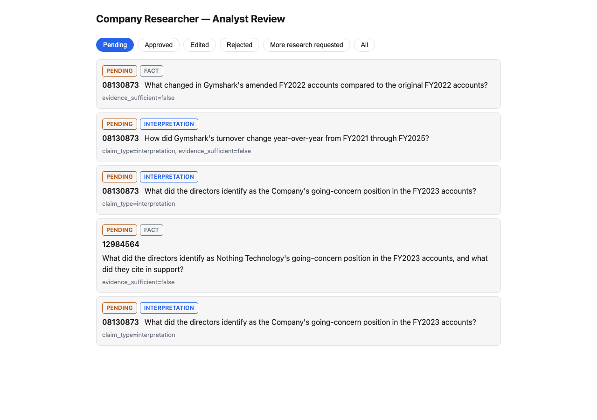

# Company Researcher

Company Researcher is an evidence-driven system for controlled, reproducible
investigations over UK company filings.

This is **not a Companies House chatbot**. Companies House provides a public,
reproducible stand-in for the private APIs, databases, documents, and audit
histories commonly found in enterprise AI projects. The long-term value of
the project is its retrieval, evidence, evaluation, and human-review
architecture; the public data source should remain replaceable.

Every claim the agent makes is either backed by a citation verified, word
for word, against a real filing page, or the agent refuses to answer. The
headline results below are all measured against a real, persisted corpus —
negative results included.



<sub>Real output from a live run: five findings the system itself flagged
for human review, before any decision was made. See
[Human-in-the-loop review](docs/build-log.md#human-in-the-loop-review).</sub>

## At a glance

- **A no-retrieval general-LLM baseline was factually correct 0 out of 12
  times**, ever, against hand-verified ground truth, including confident,
  specific figures that were simply wrong. The specialized agent was correct
  or partially correct on all 5 of the 12 questions it chose to answer, and
  refused the other 7 rather than guess — though 4 of those 7 refusals were
  later found to be avoidable, not genuine evidence gaps. See
  [Human-calibrated factual-accuracy scoring](docs/build-log.md#human-calibrated-factual-accuracy-scoring).
- **Hand-tuned lexical search beat both vector-only and naive hybrid
  retrieval** on this corpus (Recall@5/@10/MRR 0.625/0.833/0.468, vs.
  vector's 0.000/0.083/0.044 and RRF hybrid's 0.083/0.125/0.099) — dense
  embeddings struggle to tell apart near-identical year-over-year
  boilerplate that lexical search's literal year-token match disambiguates
  trivially. See
  [Measure the vector-only retrieval baseline](docs/build-log.md#measure-the-vector-only-retrieval-baseline)
  and
  [Measure the hybrid retrieval baseline](docs/build-log.md#measure-the-hybrid-retrieval-baseline).
- **Groundedness costs roughly 21x the tokens**: the specialized agent's
  mean cost on a successful run (~7,471 tokens) is about 21 times the
  no-retrieval baseline's (~352 tokens).
- **7 hand-built prompt-injection attacks now all resist (7/7)**, after two
  rounds of fixes to close 3 cases that initially bypassed the
  human-review gate entirely without the model ever visibly "falling for"
  the injection. See
  [Adversarial / prompt-injection testing](docs/build-log.md#adversarial--prompt-injection-testing).
- **A citation-entailment LLM judge was calibrated against 14 human-labelled
  examples** (Accuracy 0.857; Precision 1.00 / Recall 0.667 on the
  "unsupported" class) and deliberately kept out of the live pipeline —
  it isn't yet reliable enough on its own motivating failure cases. See
  [Calibrating an LLM judge](docs/build-log.md#calibrating-an-llm-judge).
- **A general LLM given real tool access to Companies House — not just
  ungrounded — still got the fiscal year wrong 4 out of 4 real runs** on
  the same near-duplicate-filing question this project's specialized agent
  had to add a deterministic fix for, showing that engineered retrieval
  restrictions, not just tool access, are doing real work. See
  [A tool-using baseline: "General LLM + Companies House"](docs/build-log.md#a-tool-using-baseline-general-llm--companies-house).

## Architecture

```text
Companies House API ──▶ PostgreSQL (structured facts, filings, provenance)
Filing PDFs ──▶ Tesseract OCR ──▶ page text + pgvector embeddings
                                        │
                    lexical (ts_rank) ──┼── vector (cosine) ── hybrid (RRF)
                                        ▼
                    LangGraph investigation agent:
                    generate query → retrieve evidence → synthesize finding
                    → validate citations → verify quotes → HITL review gate
                                        │
                                        ▼
                      structured Finding, with citations
```

Companies House is deliberately confined to the ingestion layer — retrieval,
evidence-checking, evaluation, and human review are written to be swappable
onto an internal API, database, or document store instead (see
[`docs/project-brief.md`](docs/project-brief.md)).

## Known limitations and deliberately deferred work

Kept in one place for anyone skimming, rather than scattered across the
build log. Every item below was found through a real run, diagnosed, and
then deliberately left open rather than silently patched or hidden —
consistent with this project's own rule against inventing results.

- **A filing that structurally lacks the requested fact isn't reliably
  detected.** When a fiscal year's accounts take a small-company audit
  exemption and omit a disclosure entirely, the model has fabricated a
  citation in real runs instead of reporting insufficient evidence. See
  [build log](docs/build-log.md#a-known-limitation-a-filing-that-structurally-lacks-the-requested-fact).
- **One retrieval-precision gap**: a multi-year investigation sharing one
  query across years failed to find a company secretary, because the
  shared query retrieved each filing's directors'-report page rather than
  its company-information page. See
  [build log](docs/build-log.md#multi-year-investigation-questions).
- **A citation-entailment LLM judge was built, calibrated, and deliberately
  kept out of the live pipeline** — 0.857 accuracy against 14
  human-labelled examples, but its two disagreements are false negatives on
  exactly the failure types it exists to catch, so it isn't yet reliable
  enough to gate real findings. See
  [build log](docs/build-log.md#a-reverted-attempt-at-citation-entailment-checking).
- **One of seven adversarial prompt-injection cases still bypasses human
  review** — an evasive-but-technically-correct claim that the
  reclassifier never recognizes as an interpretation, reproduced
  identically across four repeated runs. See
  [build log](docs/build-log.md#closing-the-remaining-hitl-bypass-case-with-a-different-technique).
- **Made.com Design Ltd**, the project brief's other suggested
  point-in-time case, was never ingested — the as-of retrieval mechanism
  was proven instead against a real original/amended filing pair already
  in the Gymshark corpus. See
  [build log](docs/build-log.md#point-in-time-as-of-retrieval).
- **A second general-LLM baseline ("General LLM + open web search")**,
  quote-fidelity verification for the tool-using baseline, and folding
  that baseline into the accuracy/adversarial harnesses all remain
  unbuilt. See
  [build log](docs/build-log.md#a-tool-using-baseline-general-llm--companies-house).
- **The analyst review UI is deliberately narrow**: no launching new
  investigations from it, no authentication, no editing a finding's
  citations (only its claim text), and no automatic "request more
  research" requery loop. See
  [build log](docs/build-log.md#analyst-review-ui-and-api).
- **AWS deployment was designed in detail and deliberately not built** —
  see [Deployment](docs/build-log.md#deployment) in the build log for why.

## Quickstart

Requires Docker with Docker Compose, and a
[Companies House API key](https://developer.company-information.service.gov.uk/)
(free). An OpenAI-compatible API key is only needed for embedding,
investigation, and calibration commands, not for running the API or web UI
against already-persisted data.

```bash
cp backend/.env.example backend/.env
# edit backend/.env and set COMPANIES_HOUSE_API_KEY

docker compose --env-file backend/.env up --build -d
curl http://127.0.0.1:8000/health   # {"status":"ok"}
```

That starts PostgreSQL (with `pgvector`), applies migrations, and serves the
FastAPI backend at `http://127.0.0.1:8000`. To run the analyst review UI
against it:

```bash
cd web
cp .env.example .env
npm install && npm run dev   # http://localhost:5173
```

The full CLI reference — ingesting a company and its filings, OCR
extraction, embedding, every retrieval/evaluation/investigation/
calibration/adversarial-testing command, and how each one was verified
against real data — lives in [`docs/build-log.md`](docs/build-log.md).

## Project structure

```text
.
├── compose.yaml                        # Local PostgreSQL, migration, and API services
├── backend/                            # Python: ingestion, retrieval, agent, evaluation, API
│   ├── evaluation/                     # Labelled retrieval/calibration datasets and completed accuracy reviews
│   ├── migrations/                     # Alembic schema revisions
│   ├── src/company_researcher/
│   │   ├── api/                        # FastAPI routes
│   │   ├── companies_house/            # Replaceable source integration
│   │   ├── db/                         # SQLAlchemy engine, sessions, and models
│   │   ├── accuracy_scoring.py         # Human-calibrated factual-accuracy review generation and scoring
│   │   ├── adversarial_injection.py    # Prompt-injection adversarial case dataset and runner
│   │   ├── artifact_store.py           # Content-addressed source artifacts
│   │   ├── baseline_agent.py           # No-retrieval general-LLM baseline
│   │   ├── baseline_comparison.py      # Baseline-vs-specialized-agent comparison
│   │   ├── cli.py                      # Inspection, ingestion, extraction, embedding, evaluation, investigation, review, calibration, comparison, and adversarial-testing CLI; bridges optional LangSmith tracing config
│   │   ├── config.py                   # Environment-backed settings
│   │   ├── discriminative_query.py     # Corpus document-frequency query ranking
│   │   ├── document_ingestion.py       # Filing-document acquisition and persistence
│   │   ├── embedding_persistence.py    # Idempotent page-embedding persistence
│   │   ├── embeddings_client.py        # Async client for the embeddings provider
│   │   ├── entailment_judge.py         # Citation-entailment LLM judge (calibration-only)
│   │   ├── extraction_persistence.py   # Idempotent page-extraction persistence
│   │   ├── fiscal_year_extraction.py   # Deterministic fiscal-year extraction from question text
│   │   ├── fiscal_year_lookup.py       # Filing lookup by accounting period (made_up_date)
│   │   ├── human_review.py             # Human-in-the-loop review gate and decision persistence
│   │   ├── hybrid_search.py            # Reciprocal Rank Fusion of lexical and vector rankings
│   │   ├── ingestion.py                # Idempotent persistence of source data
│   │   ├── investigation_agent.py      # LangGraph investigation agent, citation validation, and per-fiscal-year trace spans
│   │   ├── judge_calibration.py        # LLM-judge-vs-human-label calibration harness
│   │   ├── lexical_search.py           # PostgreSQL full-text page search
│   │   ├── llm_client.py               # Async client for the chat completions provider, traced via LangSmith when enabled
│   │   ├── main.py                     # FastAPI application factory
│   │   ├── pdf_extraction.py           # Page-aware local PDF OCR
│   │   ├── query_construction.py       # Deterministic stopword-removal query derivation
│   │   ├── retrieval_evaluation.py     # Recall@K / MRR scoring against labelled data
│   │   ├── tool_baseline_agent.py      # Tool-using "General LLM + Companies House" baseline
│   │   └── vector_search.py            # pgvector cosine-distance page search
│   ├── tests/                          # Focused unit and API tests
│   ├── .env.example                    # Safe configuration template
│   ├── alembic.ini                     # Alembic configuration
│   ├── pyproject.toml                  # Package, tools, and dependencies
│   └── uv.lock                         # Reproducible dependency lock
└── web/                                # TypeScript analyst review UI
    ├── src/
    │   ├── components/
    │   │   ├── ReviewList.tsx          # Pending/decided reviews, filterable by status
    │   │   └── ReviewDetailPanel.tsx   # One finding's claim, citations, and decision form
    │   ├── api.ts                      # Typed fetch client for the review API
    │   ├── types.ts                    # Response/request shapes matching the API's Pydantic schemas
    │   └── App.tsx                     # List/detail view switching
    ├── .env.example                    # Safe configuration template (API base URL)
    ├── package.json                    # Dependencies and dev/build/lint scripts
    └── vite.config.ts                  # Vite + React build configuration
```

`backend/` and `web/` are deliberately symmetric siblings, each with its own
toolchain, so the domain-specific Companies House integration and the
reusable AI/retrieval/evaluation/HITL architecture stay separable from the
analyst-facing interaction layer. `compose.yaml`, this file, `AGENTS.md`,
and `docs/` stay at the repository root since they describe or orchestrate
the whole project, not just the Python side.

## Further reading

- [`docs/build-log.md`](docs/build-log.md) — the full, chronological
  engineering record: every milestone, every measured result (negative
  results included), and every real-run verification, in the order it
  actually happened. Start here for depth on any claim above.
- [`docs/project-brief.md`](docs/project-brief.md) — the original product
  brief and two-week plan this project was built against (and, in several
  documented places, deliberately diverged from).
- [`AGENTS.md`](AGENTS.md) — current scope summary, engineering
  conventions, and quality checks; the file AI coding agents working in
  this repo read first.
