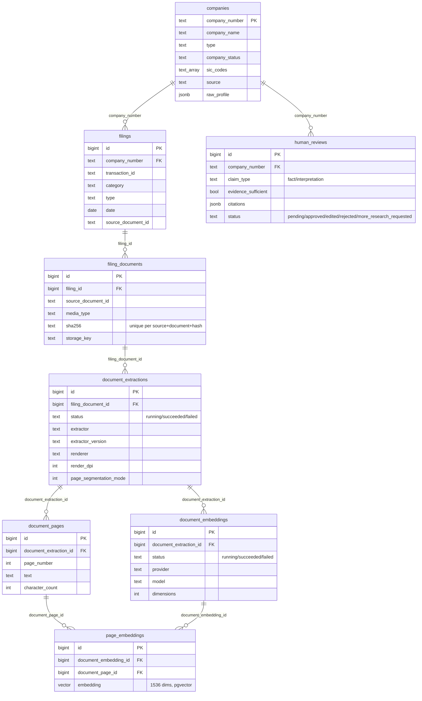
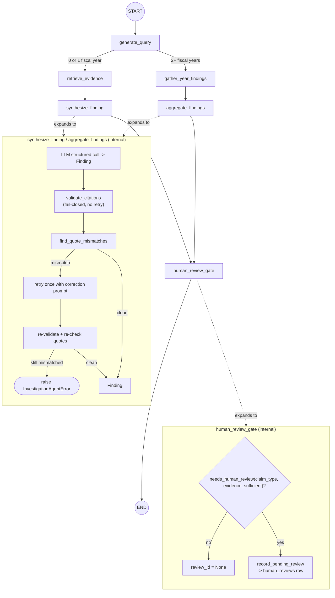
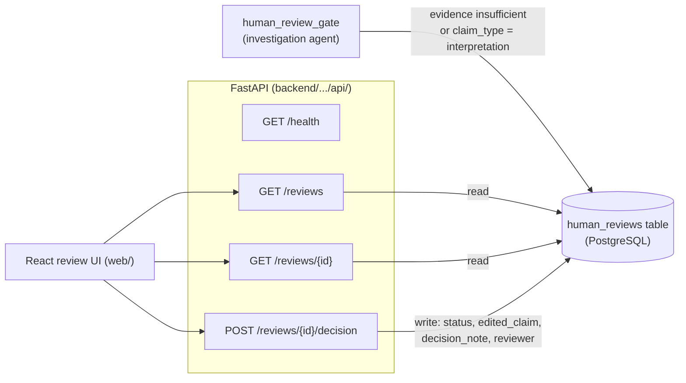

# Architecture diagrams

Two diagrams, generated from the actual code rather than redrawn from the
[README](../README.md)'s prose summary: the persisted database schema
([`db/models.py`](../backend/src/company_researcher/db/models.py)) and the
LangGraph investigation agent's real node graph
([`investigation_agent.py`](../backend/src/company_researcher/investigation_agent.py)).
Keep these in sync by hand when either file changes structurally.

## Database schema

Everything hangs off `companies` through an immutable provenance chain:
one company has many filings, one filing has many downloaded document
versions (re-downloading the same document is a new row only if its
content hash differs), one document version has many OCR extraction runs
(one per extractor/renderer/config combination), and one extraction run has
many pages and, optionally, many embedding runs over those pages.
`human_reviews` hangs off `companies` directly, independent of that chain,
since a review records a question and claim rather than a specific
document.

Notable constraints not shown above: `filing_documents` is unique on
`(source, source_document_id, sha256)`, so re-downloading unchanged content
is a no-op rather than a duplicate row; `document_extractions` is unique on
its full extractor/renderer/config tuple, so the same document can be
re-OCR'd under a different configuration without overwriting the earlier
run; and `document_embeddings` is likewise unique per
`(document_extraction_id, provider, model, dimensions)`.

## Investigation agent flow

The compiled LangGraph graph, matching `_build_graph` exactly — including a
detail the README's prose summary compresses away: citation validation and
quote verification are not separate graph nodes. Both run inside
`synthesize_finding`/`aggregate_findings` themselves (`_synthesize_and_validate`),
with one self-correction retry on a quote mismatch before the node raises.
The other compression the README makes: a genuinely multi-year question
(2+ fiscal years named) takes a different path through the graph entirely,
retrieving and grounding each year independently before a final
aggregation pass, rather than sharing one retrieval context across years.

Three deliberately asymmetric backstops run inside `synthesize_finding`/
`aggregate_findings` after the retry loop above, each only ever pushing a
finding *toward* requiring review, never away from it (see
`_apply_review_integrity_checks`): an evidence-relevance check that forces
`evidence_sufficient=False` when no citation shares a discriminative term
with the question, a question-judgement heuristic that forces
`claim_type=interpretation` when the question itself asks for a judgement,
and an evidence-blind LLM reclassification of a self-reported `fact` claim.
These exist specifically to close adversarial prompt-injection gaps found
during real testing — see the build log's
["Closing the HITL-bypass gap"](build-log.md#closing-the-remaining-hitl-bypass-case-with-a-different-technique)
section.

## Analyst review UI and its API

Neither diagram above shows where FastAPI fits, which is a fair thing to
wonder about: it plays no part in ingestion or the investigation agent
itself — both talk to PostgreSQL directly (the CLI runs in the same
process as the agent, so there's no network boundary to cross). FastAPI
exists purely because the review UI is a browser-based React app
(`web/`): a browser cannot hold database credentials or run SQL directly,
so `api/reviews.py` and `api/health.py` are a thin REST boundary the UI
calls instead, translating each HTTP request into a session-scoped query
against the same `human_reviews` table and SQLAlchemy models used
elsewhere, and running a decision through `human_review.py`'s validation
(`apply_review_decision`) before persisting it.

The REST surface here is deliberately narrow — three routes, all scoped to
reviewing findings that already exist — not a ceiling on what FastAPI
could serve. Triggering a new investigation from the UI is exactly the
kind of route this API would extend rather than replace; it's called out
as a deliberate deferral, not an oversight, in the README's
[Known limitations](../README.md#known-limitations-and-deliberately-deferred-work)
section.

`GET /health` reports only whether the process can serve requests (used
for container/deployment health checks) and does not touch the database,
unlike the three `/reviews` routes.
